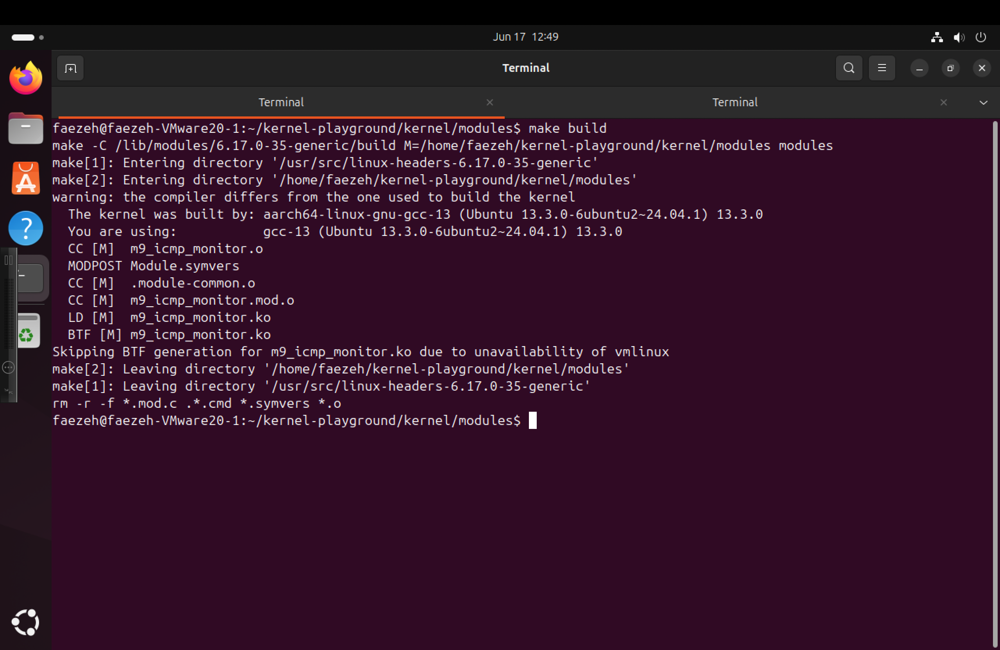
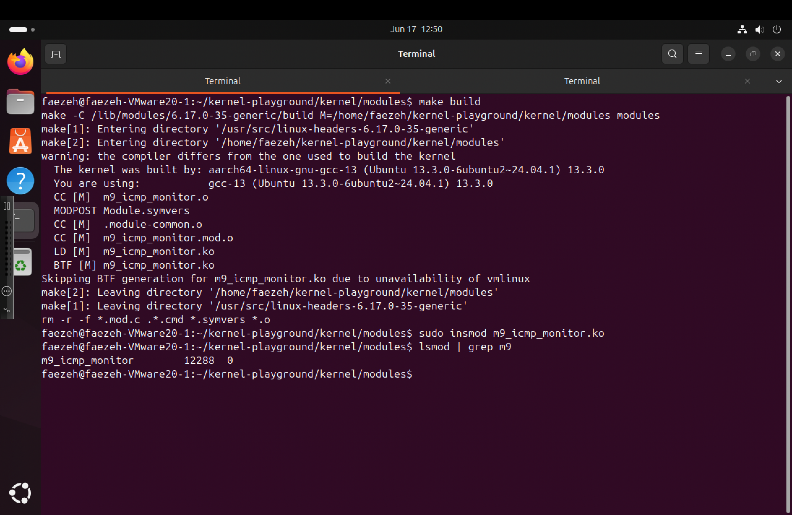
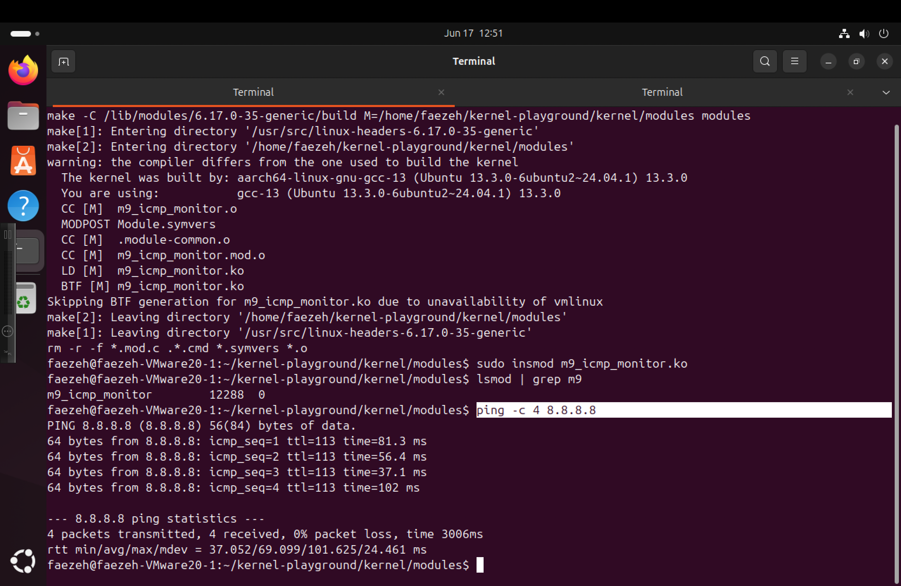
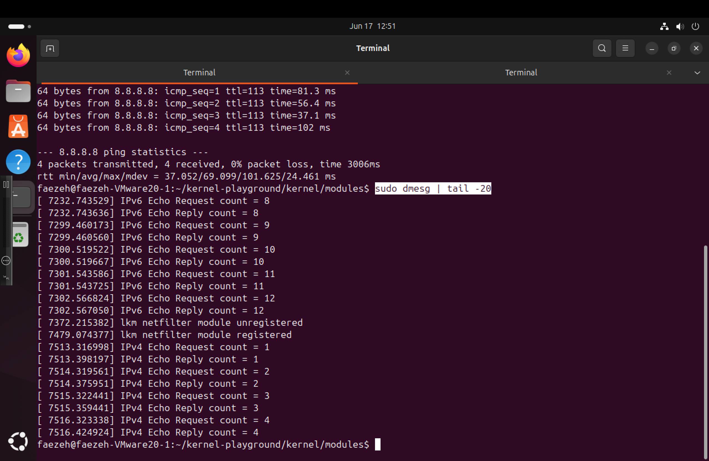
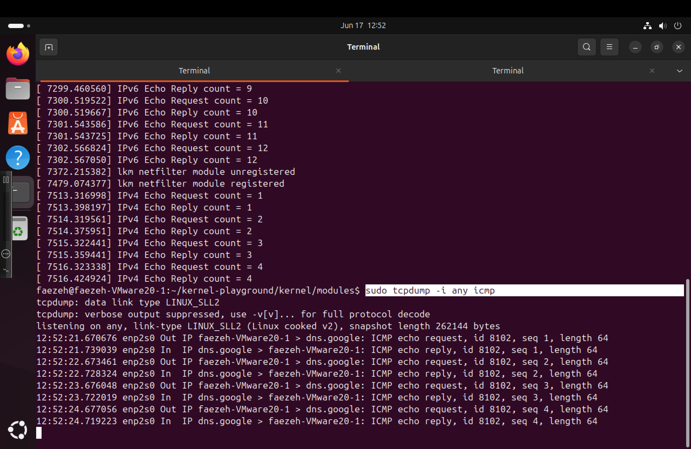
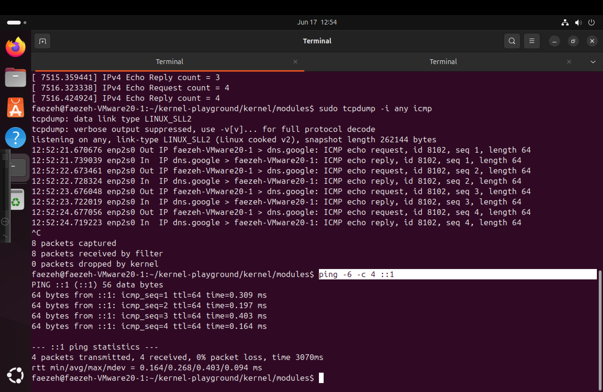
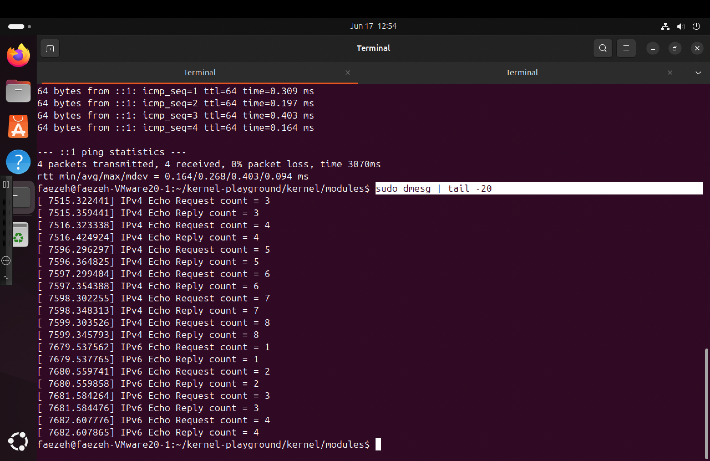
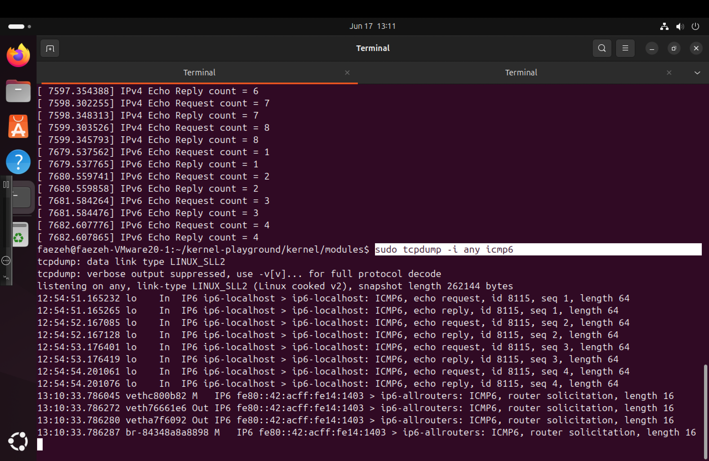
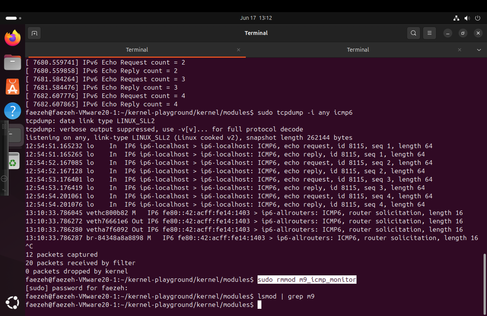

# Custom Kernel Module for Networking Extension

This project demonstrates how to create a custom Linux kernel module designed to extend the kernel's networking capabilities by adding new features.

## Usage Instructions

The directory contains a `Makefile` with predefined targets to manage the build and installation process:

### Targets

- **build**: Compile the kernel module. This will generate a `.ko` file that can be loaded into the kernel.
  
- **install**: Copy the compiled `.ko` module into the shared folder accessible within your VM. This shared folder is linked via a symbolic link named `shared` in the current directory, allowing easy access from the Guest OS running in the VM.
  
- **clean**: Remove all build artifacts, including the `.ko` file, to clean up the directory for a fresh build.

## How to Use

1. **Build the module**

   ```bash
   make build
   ```

2. **Install the module**

   ```bash
   make install
   ```

3. **Clean build artifacts**

   ```bash
   make clean
   ```

Ensure that your environment has the necessary kernel headers and build tools installed to successfully compile the module.

---

*Note:* The actual kernel module source code should be in the `linux` directory, and the `Makefile` is configured to compile it accordingly.


# M9 - ICMP Echo Monitor

## Project Overview

This project implements the M9 assignment (ICMP Echo Monitor) for the Software Networks course.

The module uses Linux Netfilter hooks to inspect network packets and count:

* ICMP Echo Requests (IPv4)
* ICMP Echo Replies (IPv4)
* ICMPv6 Echo Requests (IPv6)
* ICMPv6 Echo Replies (IPv6)

The collected statistics are printed through kernel log messages and can be verified using standard Linux networking tools.

---

## Implemented Level

**Basic Level**

Required functionality:

* Detect ICMP Echo Request packets
* Detect ICMP Echo Reply packets
* Detect ICMPv6 Echo Request packets
* Detect ICMPv6 Echo Reply packets
* Maintain packet counters

---

## Build

Compile the kernel module:

```bash
make build
```

### Build Result



---

## Loading the Module

```bash
sudo insmod m9_icmp_monitor.ko
```

### Module Successfully Loaded



---

## IPv4 Testing

Generate ICMP traffic:

```bash
ping -c 4 8.8.8.8
```

### IPv4 Ping Test



### Kernel Log Output

Counters are visible through dmesg:



### Packet Verification with tcpdump



---

## IPv6 Testing

Generate ICMPv6 traffic:

```bash
ping -6 ::1
```

### IPv6 Ping Test



### Kernel Log Output



### Packet Verification with tcpdump



---

## Removing the Module

```bash
sudo rmmod m9_icmp_monitor
```

### Module Unloaded



---

## Implementation Notes

The module registers a Netfilter hook and inspects incoming packets.

For IPv4 traffic:

* Detects ICMP protocol packets
* Identifies Echo Request and Echo Reply messages
* Updates dedicated counters

For IPv6 traffic:

* Detects ICMPv6 packets
* Identifies Echo Request and Echo Reply messages
* Updates dedicated counters

Counters are reported through printk() messages visible in dmesg.

---

## Results

The module successfully detects and counts:

* IPv4 Echo Requests
* IPv4 Echo Replies
* IPv6 Echo Requests
* IPv6 Echo Replies

The counters observed in kernel logs match the traffic captured using tcpdump.

---

## Author

Software Networks Project 2025-2026

